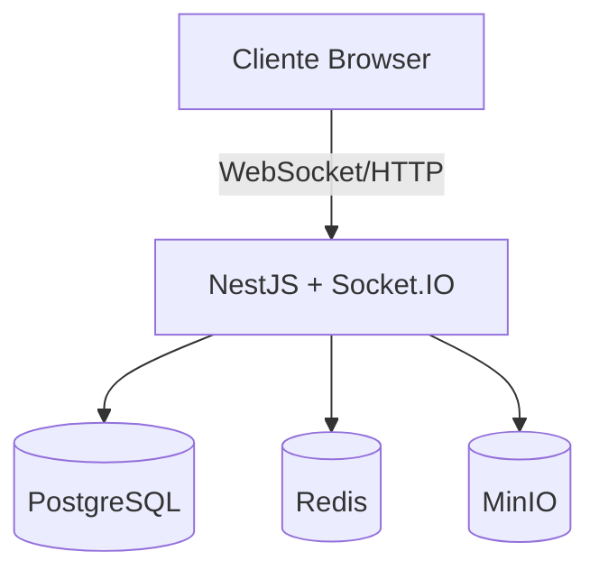

# 🚀 SaaS Chat - Sistema de Chat Corporativo em Tempo Real

[]()
[]()
[]()

> Sistema de chat corporativo desenvolvido para atendimento ao cliente e suporte interno, com arquitetura preparada para integrações ERP.

## ✨ Características Principais

- 💬 **Chat em Tempo Real** - WebSocket bidirecional com Socket.IO
- 🔐 **Autenticação JWT** - Sistema seguro com tokens de 7 dias
- 🏢 **Multi-tenancy** - Isolamento completo entre empresas
- 👥 **Indicadores Sociais** - Status online, digitando, usuários conectados
- 💾 **Persistência** - PostgreSQL com Prisma ORM
- 🎨 **Interface Moderna** - React + Tailwind CSS com tema escuro
- 📦 **Monorepo** - Arquitetura organizada com pnpm workspaces

## 🏗️ Arquitetura



## 🚀 Quick Start

### Pré-requisitos

- Node.js 18+
- pnpm 8+
- Docker & Docker Compose

### Instalação

```bash
# Clone o repositório
git clone https://github.com/rafabrdev/saas-chat.git
cd saas-chat

# Instale as dependências
pnpm install

# Configure o ambiente
cp apps/backend/.env.example apps/backend/.env
# Edite o arquivo .env com suas configurações

# Inicie os serviços Docker
docker-compose up -d

# Execute as migrations do banco
cd apps/backend
pnpm prisma migrate dev
cd ../..

# Inicie o desenvolvimento
pnpm dev
```

### 🌐 URLs de Acesso

| Serviço | URL | Descrição |
|---------|-----|----------|
| Frontend | http://localhost:5173 | Interface do chat |
| Backend | http://localhost:3000 | API REST + WebSocket |
| PostgreSQL | localhost:5432 | Banco de dados |
| Redis | localhost:6379 | Cache e sessões |
| MinIO | http://localhost:9000 | Armazenamento de arquivos |

## 📚 Documentação

Documentação completa disponível em [`/docs`](./docs/README.md)

### Estrutura do Projeto

```
saas-chat/
├── apps/
│   ├── frontend/        # React + Vite + Tailwind
│   └── backend/         # NestJS + Prisma + Socket.IO
├── packages/           # Código compartilhado (futuro)
├── docs/              # Documentação técnica
└── docker-compose.yml # Serviços locais
```

## 🧪 Testando o Sistema

### Criar usuário de teste

```bash
curl -X POST http://localhost:3000/auth/register \
  -H "Content-Type: application/json" \
  -d '{
    "name": "Teste User",
    "email": "teste@exemplo.com",
    "password": "123456"
  }'
```

### Login no sistema

1. Acesse http://localhost:5173
2. Use as credenciais criadas acima
3. Comece a conversar!

## 🛠️ Scripts Disponíveis

| Comando | Descrição |
|---------|----------|
| `pnpm dev` | Inicia frontend e backend em modo desenvolvimento |
| `pnpm dev:frontend` | Inicia apenas o frontend |
| `pnpm dev:backend` | Inicia apenas o backend |
| `pnpm build` | Build de produção |
| `pnpm lint` | Executa linting |
| `pnpm format` | Formata código com Prettier |
| `pnpm test` | Executa testes |

## 📈 Status do Desenvolvimento

### ✅ MVP Completo (Fase 1)
- Autenticação JWT
- Chat em tempo real
- Multi-tenancy
- Persistência de mensagens
- Interface responsiva

### 🚧 Em Desenvolvimento (Sprint Atual)
- Testes automatizados
- Melhorias de UX
- Otimizações de performance
- Documentação completa

### 📋 Roadmap
- Sprint 2: Chat avançado (mídia, grupos, notificações)
- Sprint 3: Painel administrativo
- Sprint 4: Integração ERP
- Sprint 5: IA e Machine Learning
- Sprint 6: Escalabilidade
- Sprint 7: Deploy e DevOps

Veja o [roadmap completo](./docs/README.md#-roadmap-de-desenvolvimento)

## 🤝 Contribuindo

### Branch Strategy

- `main` - Produção estável
- `dev` - Desenvolvimento ativo
- `feature/*` - Novas funcionalidades
- `hotfix/*` - Correções urgentes

### Padrão de Commits

Usamos [Conventional Commits](https://www.conventionalcommits.org/):

- `feat:` Nova funcionalidade
- `fix:` Correção de bug
- `docs:` Documentação
- `style:` Formatação
- `refactor:` Refatoração
- `test:` Testes
- `chore:` Manutenção

## 📊 Métricas de Performance

- ⚡ Latência de mensagens < 500ms
- 🔄 Reconexão automática em < 3s
- 💪 Suporta 10.000 conexões simultâneas
- 📈 1.000 mensagens/segundo

## 🔒 Segurança

- Autenticação JWT com refresh tokens
- Senhas hasheadas com bcrypt
- Proteção CORS configurada
- Rate limiting (em desenvolvimento)
- Validação de dados com class-validator

## 📝 Licença

Este projeto é propriedade da BR Sistemas. Todos os direitos reservados.

## 👥 Time

- **Arquiteto de Software:** Rafael BR Dev
- **Desenvolvimento:** Time BR Sistemas
- **Product Owner:** BR Sistemas

## 📞 Suporte

Para questões e suporte:
- 📧 Email: dev@brsistemas.com.br
- 💬 Slack: #team-saas-chat
- 📚 [Documentação Completa](./docs/README.md)

---

<p align="center">
  Desenvolvido com ❤️ pela equipe BR Sistemas
  <br>
  <sub>© 2024 BR Sistemas. Todos os direitos reservados.</sub>
</p>
